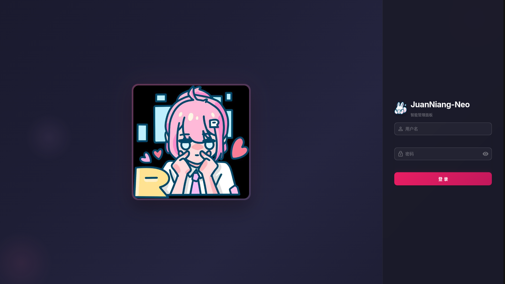
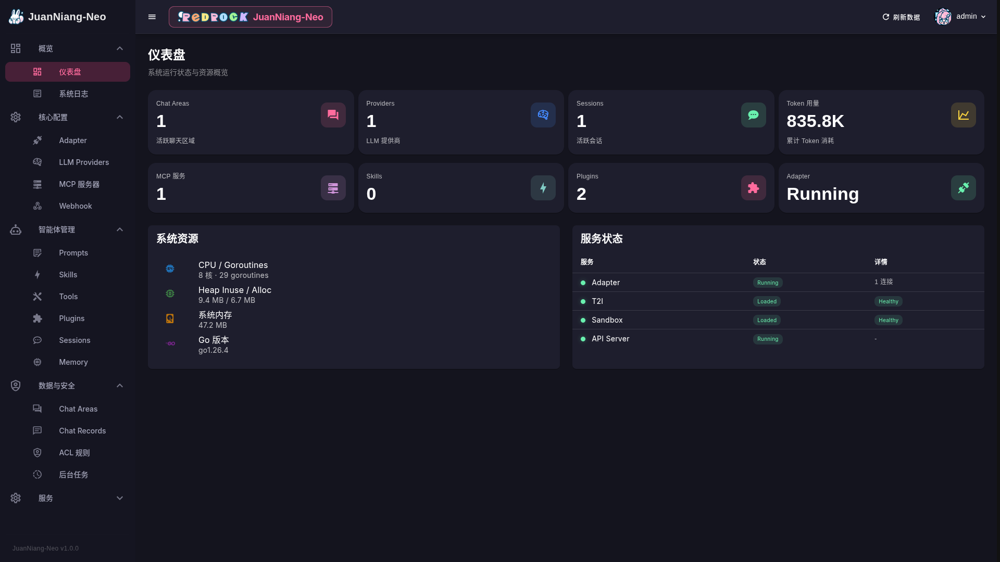
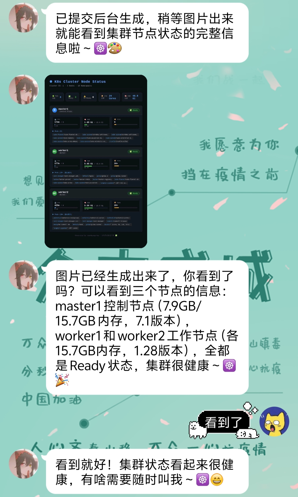

# JuanNiang-Neo


> 复活吧卷娘 — 基于 OneBot11 协议的 LLM QQ 聊天 Agent

***JuanNiang-Neo 是一个以 Go 1.25 构建的 QQ 机器人项目，红岩网校的吉祥物卷娘。***

核心由两阶段 **Planner**（规则打分 + LLM 规划）驱动的 Agent（`HagoCenter` 聚合 Planner / Replyer / Splitter / Provider / MCP / Memory / Prompt / Session / Skill / Tool）与 OneBot11 反向 WebSocket 适配器组成。长任务通过 **Drainer** 独立的排水循环执行，主 Agent 可主动查询进度。项目包含五层记忆体系（短期上下文 / 聊天回想 / 长期记忆 / 后台任务记忆 / 启发式记忆）、Lua 插件引擎、Vue 3 管理面板，以及 Postgres + Redis + Sandbox + T2I + Mem0 等可插拔基础设施。

## 主要特性

- **Agent 系统**：**两阶段 Planner**（规则打分 5 维度 + LLM 规划）+ Provider / MCP / Tool / Skill / Prompt / Plugin 多模块组合
- **事件流**：Plugin → Planner(打分+规划) → Agent 统一流水线，所有事件先经插件拦截
- **回复发送**：独立 `Replyer` 模块，支持文字/图片/图文混合发送、CQ 码自动转换、URL/base64 图片
- **消息切分**：五阶段流水线（Markdown 去除 → CQ/颜文字保护 → 概率合并 → 错别字注入 → 发送决策）
- **五层记忆**：短期上下文(Redis) + 聊天回想(PgVector) + 长期记忆(Mem0) + 后台任务记忆 + 启发式学习记忆
- **自主后台任务检测**：工具延迟追踪，5 次中 3 次 >5s 自动标记为后台任务
- **排水循环**：独立于主 Agent，只汇报最终结果，支持进度查询
- **Lua 插件系统**：gopher-lua 驱动，支持多级命令、Lua SDK（带 LuaCATS 注解）、系统插件保护、Webhook 按插件路由
- **Web 管理后台**：Vue 3 + Vuetify 3，JWT 鉴权（可选 OIDC SSO），管理全部配置与运行时状态
- **彩色日志**：基于 `fatih/color`，WARN/ERROR 携带 caller + goroutines 等 rich 元数据，Web SSE 实时推送
- **记忆 GC**：定时清理冷记忆，Web 页面可配置
- **基础设施**：Postgres + Redis + Mem0 + Sandbox + T2I，未配置时自动返回未启用提示
- **系统锁定提示词**：四层结构化提示词（铁律/记忆/工具/规范），每轮对话动态构建

## 架构概览

```
事件来源 (OneBot11/CronJob/Webhook/BgTaskResult)
    │
    ▼
┌──────────────────────┐
│  Plugin Engine       │  ← 所有事件先经插件拦截
│  (on_message/webhook  │
│   /notice/request)   │
└──────────┬───────────┘
           │ 未消费
           ▼
┌──────────────────────┐
│  Planner (两阶段)     │
│  ① 规则打分(5维)      │
│  ② LLM 规划          │
└──────────┬───────────┘
           │ 通过
           ▼
┌──────────────────────┐
│  HagoCenter (Agent)  │
│  ├ Skill/Memory匹配   │
│  ├ LLM 调用           │
│  ├ 工具调用(含排水)    │
│  └ Replyer 发送回复   │
└──────────────────────┘
```

## 效果图

- **Login UI**



- **Home**



- **Chat**



## 文档导航

| 分类 | 文档 | 说明 |
|------|------|------|
| Web API | [api.md](docs/api.md) | Web API 全路由文档（响应信封、错误码、各资源 CRUD、SSE 日志流、SPA 静态服务） |
| 项目细节 | [project-details.md](docs/project-details.md) | 四合一：分层架构 / 数据模型 / HagoCenter 运行时拓扑（mermaid）；关键调用栈（ASCII）；EventLoop 5 分支、processEvent 决策树、长任务与 CronJob/Webhook 注入时序图（mermaid）；Lua 插件系统架构生命周期与命令树（mermaid） |
| 插件开发 | [plugin-development.md](docs/plugin-development.md) | 快速开始 + 完整 Lua API 参考（log/json/onebot11/http/database/cache/t2i/sandbox/agent/command）+ 引擎实现细节 + 常见坑 |
| 部署 | [deployment.md](docs/deployment.md) | 部署模式、环境变量、构建流程、健康检查、日志排查、反向代理、systemd、FAQ |
| 二次开发 | [development.md](docs/development.md) | 该读什么 / 该改什么 / 不该动什么、当前实现状态、约定、写 Agent 工具与 Web API 的最小范式 |
| 外部服务 | [external-services.md](docs/external-services.md) | 各外部服务的客户端构造、热更新机制、HagoCenter 与 Service 共享指针、鉴权与健康检查 |
| Webhook / CronJob | [webhook-cronjob.md](docs/webhook-cronjob.md) | Webhook 接外部 HTTP 触发 Lua 插件（支持按插件路由）；CronJob 6 字段秒级 cron 主动注入 Agent；含 GitHub PR / 早安提醒示例 |

## 快速部署（Docker Compose）

镜像已发布至 `ghcr.io/juanniangdev/juan`。在任意目录新建 `docker-compose.yaml`：

```yaml
name: juanniang-neo

services:
  postgres:
    image: postgres:16-alpine
    restart: unless-stopped
    environment:
      POSTGRES_USER: ${DB_USER:-postgres}
      POSTGRES_PASSWORD: ${DB_PASSWORD:-postgres}
      POSTGRES_DB: ${DB_NAME:-juan}
    volumes:
      - pgdata:/var/lib/postgresql/data
    ports:
      - "5432:5432"
    healthcheck:
      test: ["CMD-SHELL", "pg_isready -U $${POSTGRES_USER} -d $${POSTGRES_DB}"]
      interval: 10s
      timeout: 10s
      retries: 5
    networks: [juanniang-net]

  redis:
    image: redis:7-alpine
    restart: unless-stopped
    command: redis-server --requirepass ${REDIS_PASSWORD:-root}
    ports:
      - "6379:6379"
    healthcheck:
      test: ["CMD", "redis-cli", "-a", "${REDIS_PASSWORD:-root}", "ping"]
      interval: 10s
      timeout: 10s
      retries: 5
    networks: [juanniang-net]

  juan-niang-neo:
    image: ghcr.io/juanniangdev/juan:latest
    restart: unless-stopped
    init: true
    ports:
      - "8081:8081"   # OneBot11 反向 WS
      - "8090:8090"   # Web API + 仪表板
      - "8091:8091"   # Webhook HTTP 服务 (可选)
    environment:
      WEB_DIR: /app/web/dist
      OB_PORT: "8081"
      API_ADDR: ":8090"
      DB_HOST: postgres
      DB_PORT: "5432"
      DB_USER: ${DB_USER:-postgres}
      DB_PASSWORD: ${DB_PASSWORD:-postgres}
      DB_NAME: ${DB_NAME:-juan}
      REDIS_ADDR: redis:6379
      REDIS_PASSWORD: ${REDIS_PASSWORD:-root}
      JWT_SECRET: ${JWT_SECRET:-change-me-in-production}
      OB_TOKEN: ${OB_TOKEN:-}
      OB_ADMINS: ${OB_ADMINS:-}
      # Mem0 记忆服务 (可选)
      MEM0_BASE_URL: ${MEM0_BASE_URL:-}
      MEM0_API_KEY: ${MEM0_API_KEY:-}
    depends_on:
      postgres: { condition: service_healthy }
      redis:    { condition: service_healthy }
    volumes:
      - ./data/pluggins:/app/data/pluggins   # Lua 插件跨升级保留
    healthcheck:
      test: ["CMD-SHELL", "wget -qO- http://127.0.0.1:8090/health || exit 1"]
      interval: 30s
      timeout: 10s
      retries: 3
      start_period: 20s
    networks: [juanniang-net]

volumes:
  pgdata:

networks:
  juanniang-net:
    driver: bridge
```

同目录放 `.env`（按需修改）。**首次启动前**需创建插件目录并赋权：

```bash
mkdir -p data/pluggins && chmod 777 data/pluggins
docker compose up -d
# 仪表板  http://localhost:8090   初始账号 admin / Admin123（首次启动务必改密码）
# OneBot11 反向 WS  ws://localhost:8081/   带头 Authorization: Bearer <OB_TOKEN>
# Webhook  HTTP POST  http://localhost:8091/webhook/<plugin_name>
```

更多部署细节（裸机、反代、systemd、故障排查）见 [deployment.md](docs/deployment.md)。

## 许可证

本项目采用 [MIT License](LICENSE)。
