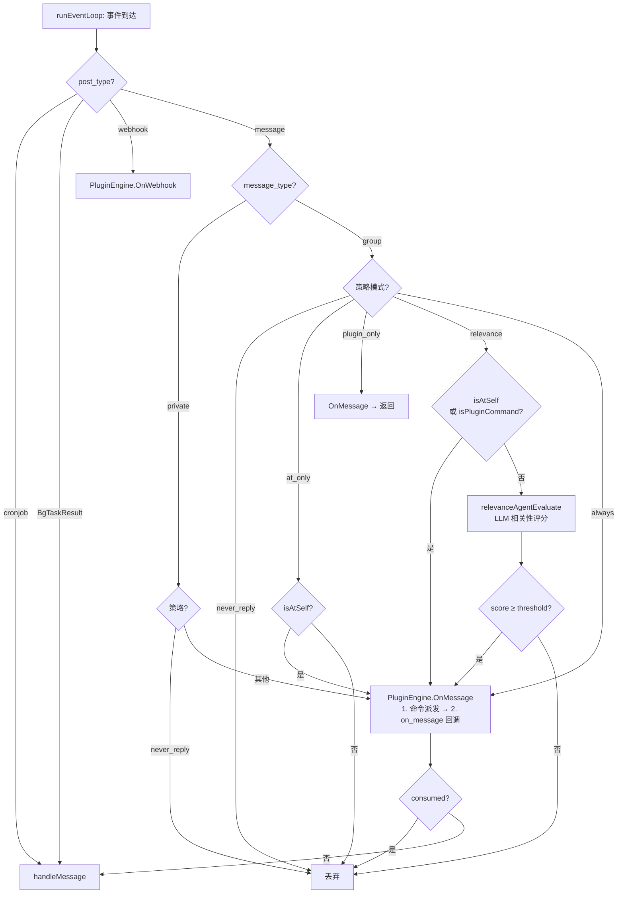
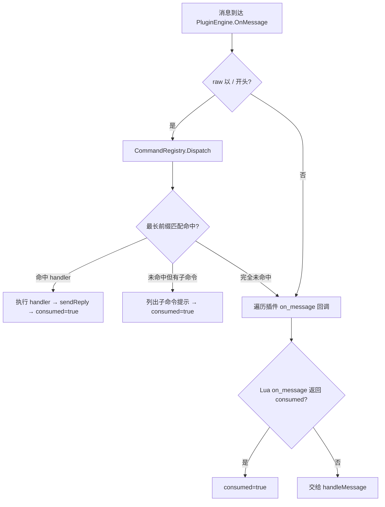
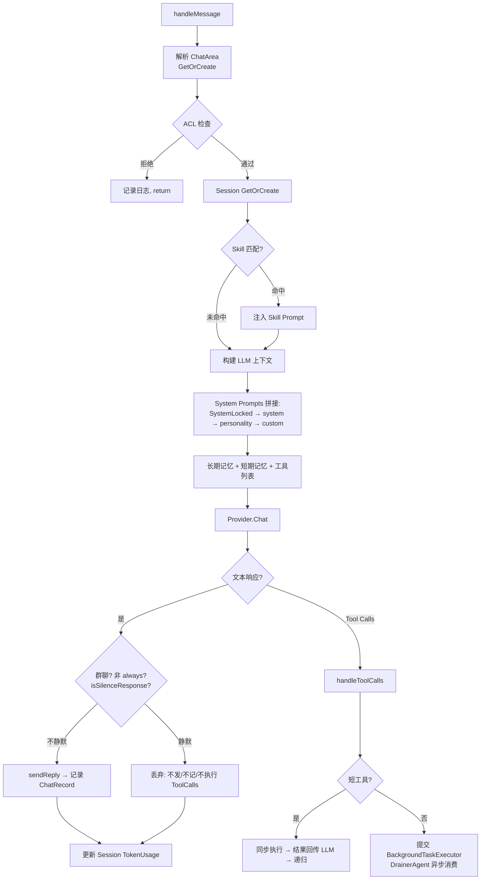

# 事件流

## 完整事件流 (OneBot11 → QQ 消息)

```
┌─────────────┐
│  OneBot11   │  反向 WS 连接
│  客户端      │  (go-cqhttp / NapCat / LLOneBot)
└──────┬──────┘
       │ JSON 事件 (message/notice/request/meta_event)
       ▼
┌─────────────────────────────────────────────────────────────┐
│  adapter/server.go                                          │
│  ┌──────────┐    ┌───────────┐    ┌────────────────────┐   │
│  │ wsConn   │───▶│ readLoop  │───▶│ parseEvent         │   │
│  │ handleWS │    │ (WS read) │    │ (gjson → Event)    │   │
│  └──────────┘    └───────────┘    └─────────┬──────────┘   │
│                                             │              │
│                               events chan (buffer 128)     │
└─────────────────────────────────────────────┼──────────────┘
                                              │
                                              ▼
┌─────────────────────────────────────────────────────────────┐
│  agent/event.go: runEventLoop                               │
│                                                             │
│  ┌──────────────────────────────────────────────────────┐  │
│  │ 1. 过滤非 message 事件                                 │  │
│  │ 2. Plugin 拦截 (pluggin.OnMessage)                    │  │
│  │    ┌─────────────────────────────────────────────┐   │  │
│  │    │ PluginEngine 存储 currentEv (事件上下文)      │   │  │
│  │    │                                             │   │  │
│  │    │ 2a. 命令派发 (NEW, 优先 on_message)            │   │  │
│  │    │   if raw_message 以 "/" 开头:                │   │  │
│  │    │     CommandRegistry.Dispatch(raw, event)     │   │  │
│  │    │       ├─ 最长前缀匹配命令树                    │   │  │
│  │    │       ├─ 命中 handler → 调用并自动回复          │   │  │
│  │    │       │   handler(args, event) →              │   │  │
│  │    │       │     (consumed, reply, err)             │   │  │
│  │    │       └─ 未命中但有子命令 → 列出子命令提示       │   │  │
│  │    │     if consumed: continue loop                │   │  │
│  │    │                                             │   │  │
│  │    │ 2b. on_message 回调 (fallback)                │   │  │
│  │    │ for each plugin:                             │   │  │
│  │    │   if has on_message():                       │   │  │
│  │    │     call on_message(event) → (consumed, ..)  │   │  │
│  │    │     if consumed: skip agent, continue loop   │   │  │
│  │    │                                             │   │  │
│  │    │ 插件可调用 (通过 require("jn") SDK):           │   │  │
│  │    │   jn.onebot11.*  (20 fn) — 消息/群管理/查询   │   │  │
│  │    │   jn.http.*      (2 fn)  — 外部 API          │   │  │
│  │    │   jn.database.*  (2 fn)  — 插件数据 CRUD     │   │  │
│  │    │   jn.cache.*     (4 fn)  — 插件缓存          │   │  │
│  │    │   jn.t2i.*       (5 fn)  — 图片生成 + 开关   │   │  │
│  │    │   jn.sandbox.*   (6 fn)  — 沙箱执行 + 开关   │   │  │
│  │    │   jn.agent.*     (16 fn) — 配置/Provider/MCP │   │  │
│  │    │                          /Tool/Switch/Compact│   │  │
│  │    │   jn.command.register — 注册多级命令           │   │  │
│  │    └─────────────────────────────────────────────┘   │  │
│  │ 3. Agent 处理 (handleMessage)                         │  │
│  │    └─ BuildSystemPrompt 优先级:                      │  │
│  │       SystemLocked(IsSystem) → system → personality  │  │
│  │       → custom (内容直接拼接, 不再渲染模板)            │  │
│  └──────────────────────────────────────────────────────┘  │
└─────────────────────────────────────────────────────────────┘
```

## 完整事件流 (CronJob → 定时任务)

```
┌──────────────────────┐
│  CronJobManager      │  来自 pluggin.yaml
│  cron 定时表达式      │  (如 "0 */1 * * *")
└──────────┬───────────┘
           │ Run() → 遍历已注册 cron job
           │ 到期触发 → 构造 Event
           ▼
┌─────────────────────────────────────────────────────────────┐
│  构造事件                                                    │
│  ┌──────────────────────────────────────────────────────┐  │
│  │  PostType = "cronjob"                                 │  │
│  │  IsCronJob = true                                     │  │
│  │  RawMessage = 插件注册时指定的文本                      │  │
│  │  UserID = "system" / GroupID = ""                     │  │
│  └──────────────────────────────────────────────────────┘  │
│                           │                                 │
│              CronJobEvents chan (buffer 32)                 │
└───────────────────────────┼─────────────────────────────────┘
                            │
                            ▼
              runEventLoop 统一监听处理
              (与 OneBot11 事件共用同一事件循环)
```

## 完整事件处理流程 (含回复策略)



## 插件命令与 Agent 拦截



## Agent 处理流程 (handleMessage)



## 后台任务流

```
handleToolCalls (long-running tool)
│
├─ 构建 TaskStep[] (含依赖关系 DAG)
├─ BackgroundTaskExecutor.Submit
│     │
│     ├─ 写入 DB (BackgroundTask, status=pending)
│     ├─ 启动 goroutine executeAsync
│     │     │
│     │     ├─ status → running
│     │     ├─ errgroup 并发执行无依赖步骤
│     │     ├─ 每个步骤完成 → PushResult(OutputChan)
│     │     └─ 全部完成 → status → done
│     │
│     └─ 返回 "任务已提交后台执行"
│
└─ DrainerAgent (独立 goroutine)
      │
      ├─ 监听 OutputChan
      ├─ 按 ChatArea 分组累积结果
      ├─ 每 3 个步骤 → 发送进度更新
      └─ task done → LLM 整合 → 发送最终消息
```

## 事件循环生命周期

```
Start()
│
├─ go BgTaskExecutor.Run(ctx)
├─ go DrainerAgent.Run(ctx)
├─ go CronJobManager.Run(ctx)
├─ CronJobEvents chan (buffer 32)     ← cron 事件源
└─ go runEventLoop(ctx)                ← 阻塞主循环
      │
      ├─ case ev := <-adapter.Events()       ← OneBot11 事件
      ├─ case ev := <-CronJobEvents           ← CronJob 事件
      ├─ case ev := <-BgTaskResultChan        ← 后台任务完成事件
      │
      └─ processEvent(ctx, ev)
           │
           ├─ 回复策略评估 (processEvent 层)
           │     ├─ CronJob/BgTaskResult → 直接进 Agent
           │     ├─ 私聊: never_reply → 跳过, 其他 → 继续
           │     └─ 群聊: 按策略模式决定是否继续
           ├─ Plugin 拦截 (OnMessage: 命令派发 → on_message 回调)
           └─ handleMessage (LLM Agent)
                 │
                 ├─ 同步工具 → 立即回复
                 └─ 异步工具 → DrainerAgent 回复
```
