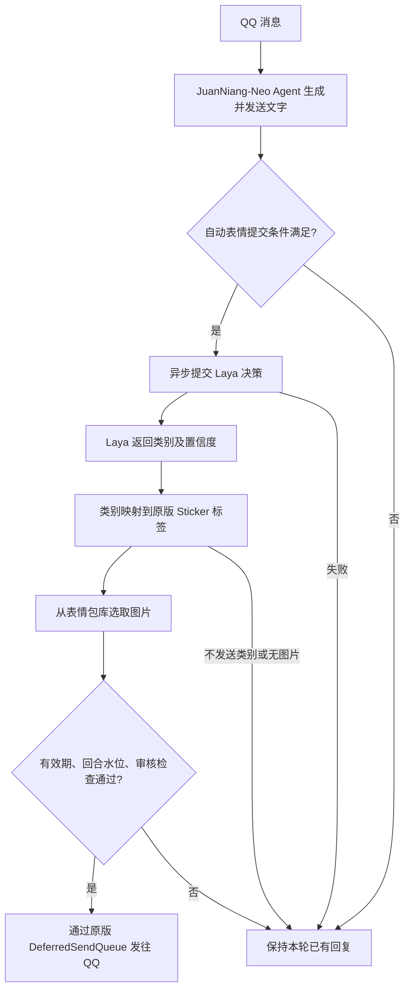

# Laya 自动表情接入指南

本文面向首次接入的使用者，以及维护 Laya HTTP 适配的开发者，以当前仓库源码为准。当前支持 `systemone.v1` 原生协议和 `json` 可配置协议。

## 1. 功能与工作流程

Laya 是可选的外部表情决策服务：根据用户消息和卷娘的回复选择一个类别。聊天、工具调用和文字回复仍由 JuanNiang-Neo 的 Agent 完成；Laya 不替代聊天大模型，也不需要添加到 **LLM Providers**。它返回类别和置信度，图片由卷娘现有的表情包库提供。

功能默认关闭。关闭时保持原版回复、`send_sticker`、`send_face` 等工具流程，不提交 Laya 自动表情任务。



自动表情是文字发送后的可选追加，不保证每条消息都有图片。Laya 故障不会撤回已发送的文字，也不会为此重新生成文字。

## 2. Laya 服务接口

以下接口属于**外部 Laya 服务**，不是卷娘的 `/api/v1` 管理接口。示例模型 ID `multilingual` 仅为示例，必须换成所部署服务实际支持的 ID。接口成功响应是下面的原始 JSON，不套卷娘 Web API 的 `{status, info, data}` 信封。

### GET /capabilities

请求没有 JSON 请求体。配置 API Key 时，客户端携带 `Authorization: Bearer <API Key>`。

一个可被当前客户端接受的动态类别能力响应：

```json
{
  "schema_version": 1,
  "service": "laya",
  "api": {
    "protocol": "systemone.v1",
    "decision_path": "/v1/systemone",
    "method": "POST"
  },
  "models": [
    {
      "id": "multilingual",
      "loaded": true,
      "sticker": {
        "category_mode": "dynamic",
        "suggested_categories": [
          { "id": "HAPPY", "description": "开心、快乐、庆祝", "enabled": true, "no_send": false },
          { "id": "COMFORT", "description": "安慰、鼓励、关心", "enabled": true, "no_send": false },
          { "id": "NONE", "description": "不发送表情包", "enabled": true, "no_send": true }
        ]
      }
    }
  ],
  "response": {
    "category_pointer": "/answers/sticker/choice",
    "confidence_pointer": "/answers/sticker/answer_confidence"
  }
}
```

当前校验要求 `schema_version` 为 `1`、`service` 为 `laya`，协议名非空、决策路径以 `/` 开头、方法为 `POST`，且至少有一个 ID 唯一的模型。`category_mode` 支持 `dynamic` 和 `fixed`：动态模式用 `suggested_categories` 提供建议，固定模式用 `categories` 展示类别。`max_categories` 可省略；提供时必须为正数。

`loaded` 是可选布尔值：`true` 显示“已加载”，`false` 显示“未加载”，缺省显示“未提供状态”。它会随快照保存，但当前客户端不会用它阻止决策请求，也不会自动加载模型。

能力发现只展示服务信息及类别差异，**不会自动改写 Endpoint、协议、模型、响应路径或类别映射**，也不会按 `max_categories` 自动裁剪类别。管理员仍需根据服务能力填写配置。`source_endpoint` 和 `source_capabilities_endpoint` 由卷娘按实际请求补入快照，外部服务不必返回。

### POST /v1/systemone

原生模式自动构造以下结构；`instructions` 与当前客户端内置指令一致：

```json
{
  "model": "multilingual",
  "state": {
    "user_message": "今天终于把项目跑通了！",
    "assistant_reply": "太好了，恭喜你！"
  },
  "questions": {
    "sticker": {
      "type": "choice",
      "instructions": "根据当前对话和助手回复，判断是否需要追加表情，并从候选类别中选择最合适的一项。",
      "criteria": {
        "HAPPY": "开心、快乐、庆祝",
        "COMFORT": "安慰、鼓励、关心",
        "NONE": "不发送表情包"
      }
    }
  }
}
```

`questions.sticker.criteria` 必须是 **类别 ID → 类别描述的对象**，不是 `["HAPPY", "COMFORT", "NONE"]` 数组。原生请求由所有启用类别生成，包含启用的“不发送”类别，排除禁用类别；不会把 Sticker 标签、图片 ID 或 `no_send` 内部字段一起发送。原生 `state` 只有 `user_message`、`assistant_reply`，没有 `message_type` 字段。

成功响应示例：

```json
{
  "answers": {
    "sticker": {
      "type": "choice",
      "choice": "HAPPY",
      "answer_confidence": 0.88
    }
  }
}
```

默认从 `/answers/sticker/choice` 读取类别，从 `/answers/sticker/answer_confidence` 读取置信度。默认置信度字段是 **`answer_confidence`**，不是 `confidence`。类别必须是非空字符串；置信度若存在，必须是 `0` 到 `1` 的数值。

返回 `"choice": "NONE"` 时，按下文示例配置会不发送图片。`NONE` 只是推荐命名，代码真正判断的是匹配类别的 `no_send` 标志：自定义 ID 也可以表示不发送，名为 `NONE` 的类别也必须勾选“不发送”。

## 3. 部署外部服务与检查连通性

Laya 是独立运行的 Python 服务，JuanNiang-Neo 通过 HTTP 调用它。本仓库提供 Go 客户端，没有附带外部 Python 服务源码、模型权重、安装清单或启动入口；现有卷娘 Compose 也不会自动启动 Laya。

部署时按所选 Laya 服务版本的说明完成以下步骤：

1. 在独立目录或容器中安装该服务要求的 Python 环境、依赖和模型权重，确认该版本的 CPU/GPU、显存和模型加载要求。
2. 使用该服务提供的启动命令，配置监听地址、端口及鉴权。跨容器访问时，服务需要监听容器可达的地址，不能只绑定其自己的回环地址。
3. 确认模型 ID 和 `/v1/systemone` 的真实请求、响应结构与上一节一致；可先用下方 `curl` 直接验证。
4. 若需要页面能力展示，确认服务还提供满足上述 schema 的 `GET /capabilities`；若部署在路径前缀后，可显式填写能力接口的完整 URL。
5. 再连接卷娘。Laya 的安装包名、模块入口和模型下载命令由外部项目决定，不应把卷娘的 `make run` 当作 Laya 启动命令。

### `/capabilities` 需要由谁实现？

**本项目的 Go 代码不会自动为外部 Python 服务添加 `/capabilities`。** 它只是发出 GET、校验响应并展示或保存快照。服务未实现时，应由外部服务维护者实现，或在其部署侧提供与真实服务状态一致的兼容接口。

| 外部服务状态 | 可以做什么 | 受影响的功能 |
| --- | --- | --- |
| 决策接口和能力接口都兼容 | 能力预览、正式快照、自动表情决策 | 仍需手动配置类别和图库 |
| 决策接口可用，能力接口 404 或 schema 不兼容 | 手动配置 Endpoint、模型、协议、类别后继续决策 | 检测按钮和保存后的能力刷新报错，模型状态及服务建议无法可靠展示 |
| 能力接口成功，但决策接口失败 | 展示能力信息 | 不能据此确认自动表情可用，需单独验证 POST |

能力发现失败不会回滚已经保存的回复设置，也不是自动决策的前置条件。页面可能同时显示“配置已保存”和“能力刷新失败”，这两条信息并不矛盾。

### 通用连通性检查

从 **JuanNiang-Neo 所在的网络环境**检查，而不只是从浏览器所在的电脑检查。下面使用 Bash、`curl` 和示例端口 `8000`，请替换为实际地址。`LAYA_API_KEY` 可由本地环境提供；不需要鉴权时保持未设置。

```bash
LAYA_BASE_URL='http://127.0.0.1:8000'
laya_auth=()
if [ -n "${LAYA_API_KEY:-}" ]; then
  laya_auth=(-H "Authorization: Bearer ${LAYA_API_KEY}")
fi

curl --fail-with-body --silent --show-error --max-time 10 \
  "${laya_auth[@]}" -H 'Accept: application/json' \
  "${LAYA_BASE_URL}/capabilities"
```

将上一节的原生 POST 请求 JSON 保存为 `/tmp/laya-request.json`，修改其中的模型 ID 后，在同一终端执行：

```bash
curl --fail-with-body --silent --show-error --max-time 10 \
  "${laya_auth[@]}" -H 'Content-Type: application/json' \
  --data-binary @/tmp/laya-request.json \
  "${LAYA_BASE_URL}/v1/systemone"
```

Docker 容器里的 `localhost` / `127.0.0.1` 指向该容器本身，不是宿主机，也不是另一个容器。若两个服务在同一个 Docker 网络，可用外部服务的网络名称，例如 `http://laya:8000/v1/systemone`；这里的 `laya` 必须是你实际部署的服务名。访问宿主机服务时使用容器可达的宿主机地址或已经配置好的主机别名，不能假设所有环境都能解析同一个特殊域名。反向代理、防火墙和端口映射也必须允许卷娘访问。

## 4. Web 管理页面配置

### 先准备表情包库

在卷娘的表情包库中准备可发送的图片，并为它们设置标签，例如“开心”“庆祝”“安慰”“鼓励”。仅在图床上传文件，或仅创建一个空标签，不等于已经有可匹配的 Sticker 记录。先通过原版表情工具验证这些图片能发到 QQ，再排查 Laya 链路。图库和管理 API 见 [表情包库文档](api.md#25-表情包库)。

Laya 不生成图片、不下载图片，也不返回 Sticker ID；它只返回类别。类别描述用于语义判断，Sticker 标签用于卷娘本地选图，两者分工不同。

### 填写“回复设置 → Laya 表情决策”

| 页面字段 | 设置方式及实际行为 |
| --- | --- |
| 启用自动表情 | 默认关闭。配置完整并保存后开启；仅修改开关但不保存不会生效。 |
| 决策 Endpoint | 填写完整 HTTP/HTTPS URL，包括 `/v1/systemone` 等决策路径。原生模式也不会自动拼接该路径。 |
| Capabilities Endpoint（可选） | 填写完整能力 URL；留空时使用决策地址的协议和主机，路径替换为根路径 `/capabilities`，不保留路径前缀和查询参数。 |
| 模型 ID | 填 Laya 实际提供的模型 ID；原生模式必填。它不是卷娘 Providers 中的模型条目 ID。 |
| 协议模式 | `systemone.v1（Laya 原生协议）` 自动构造请求；`JSON（可配置）` 使用下方模板。数据库默认模式仍为 `json`，接原生服务时需主动选择原生模式。 |
| HTTP 方法 | 当前两种模式都只支持 `POST`。 |
| 请求超时（秒） | 默认 `10`，页面范围 `1–120`。控制外部请求等待，不会拖延已经发出的文字。 |
| 最低置信度（可选） | `0` 表示不按置信度过滤；大于 `0` 时，置信度缺失或低于下限都会丢弃自动表情。不要把页面的简短提示理解成“缺字段就放行”。 |
| 自动表情有效期（秒） | 默认 `30`，从入队开始计时，包含排队时间。页面标注 `1–300`；后端对非正数恢复默认 `30`，`0` 不是无限有效。 |
| API Key | 用于能力 GET 和决策 POST 的 Bearer 鉴权。留空保持已保存的 Key；勾选“明确清除已保存的 API Key”才会删除。GET 不返回明文。 |

例如决策地址为 `https://laya.example/prefix/v1/systemone` 时，留空能力地址会访问 `https://laya.example/capabilities`，不是 `/prefix/capabilities`。如果外部服务需要前缀，必须显式填写。

原生模式隐藏 JSON 模板和响应路径输入框，不需要填写请求模板，使用默认响应路径即可。底层解析仍共用已保存的 JSON Pointer；从自定义 JSON 模式切换前，如果曾改过响应路径，应先将两条路径恢复为 `/answers/sticker/choice`、`/answers/sticker/answer_confidence`，再切换并保存。切换协议不会根据能力快照自动重置这些路径。

### 类别映射示例

| ID | 说明 | Sticker 标签 | 启用 | 不发送 |
| --- | --- | --- | --- | --- |
| `HAPPY` | 开心、快乐、庆祝 | 开心、庆祝 | 是 | 否 |
| `COMFORT` | 安慰、鼓励、关心 | 安慰、鼓励 | 是 | 否 |
| `NONE` | 不发送表情包 | 留空 | 是 | 是 |

标签列中每个词应作为独立标签项添加。`HAPPY` 返回后，卷娘汇总“开心”或“庆祝”标签的候选图片；不要求图片同时具有两个标签。类别 ID 按配置精确匹配，注意大小写，不要添加首尾空格。至少需要一个启用的“不发送”类别，描述也不能为空。禁用类别不会进入原生决策候选。

类别下只有一张图片也可以运行，但希望减少重复时应准备多张不同图片。能力接口列出的类别只是建议，页面不会替你创建映射、标签或图片。

### 可配置 JSON 模式

服务结构兼容但需要自定义指令或字段时，可使用 JSON 模式。以下是**页面模板语法**，其中未加引号的 `{{criteria_map}}` 会由客户端替换为 JSON 对象，不能直接作为 HTTP JSON 发送：

```text
{
  "model": "{{model}}",
  "state": {
    "user_message": "{{user_message}}",
    "assistant_reply": "{{assistant_reply}}"
  },
  "questions": {
    "sticker": {
      "type": "choice",
      "instructions": "判断是否发送表情包并选择类别",
      "criteria": {{criteria_map}}
    }
  }
}
```

类别 JSON Pointer 填 `/answers/sticker/choice`，置信度 JSON Pointer 填 `/answers/sticker/answer_confidence`。JSON 模式必须有有效模板；切回该模式后会重新校验模板。

可用变量还有 `{{message_type}}`、`{{categories}}`、`{{enabled_categories}}` 和 `{{criteria}}`。其中 `criteria` 是保留兼容的 ID 数组，**不适合填入 Laya 原生 `questions.sticker.criteria`**；应使用 `criteria_map`。结构化变量应占据完整 JSON 值位置，不要把它拼到普通字符串中。

### “检测”与“保存”不同

- **检测连接并获取能力**：用表单当前值请求能力接口，包括未保存的地址和 Key；返回标为“临时预览”的结果。成功或失败都不修改数据库中的正式配置、能力快照、获取时间或错误状态，也不发出决策 POST。
- **保存回复设置**：保存并校验配置，通知 Agent 使配置缓存失效；随后页面按已保存配置重新获取正式快照。一次已经入队的任务持有自己的配置副本，不会因本次保存而重写请求。
- 正式刷新失败会保留同一来源的上次成功快照并记录错误。保存时修改决策地址、能力地址或 API Key，会清除旧能力状态。刷新期间来源变化导致更新未命中时，返回业务状态 `40901`：“配置已变化，请重新检测”，而不是提示成功。

页面显示快照来源地址、获取时间和模型加载状态。旧快照未记录来源时应重新获取；临时预览成功不表示新地址已用于机器人的正式决策。

管理接口细节见 [回复策略 API](api.md#22-回复策略) 和 [OpenAPI](../api/openapi.yaml)。外部服务的 `/capabilities` 与卷娘的 `/api/v1/reply-strategy/laya/capabilities` 是不同接口，后者是供管理员调用的代理及快照管理入口。

## 5. 发送策略与故障回退

### 哪些回合会进入 Laya？

先由原版相关性、审核、工具和回复流程决定是否回复。正常最终文字全部发送成功、Laya 已启用、没有面向当前会话的主要工具交付、没有排队的表情表达、且文字审核未拒绝时，才提交自动表情任务。文字为空、静默、发送不完整或目标无效时，不会补发 Laya 图片。

**最终文字中的普通内联 QQ 小表情不会单独阻止 Laya 决策**；例如文字带 `[CQ:face,id=14]` 仍可进入 Laya。用户输入中的小表情也不等于机器人已经发过图片。最终回复已含 `stk://` 图库图片时，则阻止重复追加。

这里要区分内联文字和工具队列：当前 `DeferredSendQueue.HasExpressionTo` 仍将独立 `send_face` 等工具消息中的 face 段、图库图片段视为已安排的表情，阻止追加。不能把“内联小表情不阻止”推广为“所有 QQ face 工具调用都不阻止”。

### 异步、有效期和审核

- **文字先发**：HTTP 决策由独立 worker 执行，不占用文字发送的顺序锁或本轮 Agent 并发令牌。选好图片后，才取得发送锁并复查条件，通过原版 `DeferredSendQueue.SendNow` 发送 `stk://` 图片。
- **有界队列**：当前有 4 个 worker，每个分片最多排队 32 个任务。同一群或私聊固定到同一分片，串行处理；队列满或处理器停止时直接丢弃，不阻塞正常回复。这些是源码常量，不是页面选项。
- **请求超时与任务有效期分开**：超时限制处理中的请求，有效期从入队开始。即使 HTTP 成功，只要任务已过期，仍不发送。有效期会在请求前、决策后和最终发送前复查。
- **回合水位**：同一目标有更新的回复回合经过发送收尾阶段时，旧任务失效；即使新回合没有追加 Laya，也会推进水位。持续快速发消息可能使旧任务不断被淘汰。
- **审核复查**：原版文字最多等待群审核 5 秒，超时按原规则放行。Laya 自动表情在最终发送前再查 `ReviewGate`，`blocked` 或仍为 `pending` 都丢弃，不继续等待。私聊、未启用群管理或没有审核记录时按现有闸门放行。

### 选图与去重

每个映射标签查询最近创建的最多 50 张表情，合并后按 Sticker ID 去重，再随机选取。优先排除该目标最近成功发送的 3 张 Laya 自动表情；如果所有候选都在近期窗口内，则允许重复。记录仅在发送成功后更新，保存在内存中，重启或缓存清理后不保证延续。

这是减少重复的策略，不是“永远不重复”，也不是对所有原版表情工具建立全局发送历史。只有一个候选、多个标签指向同一张图，或者不同 Sticker ID 实际引用相同图片，都可能看到相同画面。

### 三种“不追加图片”要分别判断

| 情况 | 实际含义 | 如何确认 |
| --- | --- | --- |
| Laya 返回不发送类别 | 决策成功，匹配类别启用了 `no_send` | 查看 POST 响应的 `choice` 和页面类别映射，例如 `NONE` |
| Laya 调用失败 | 超时、连接失败、非 2xx、JSON/响应字段无效等，没有可用决策 | 查看 `reason=decide_error` 或配置校验日志；已发文字保留，本次不自动重试 |
| 类别下没有可用图片 | 有类别结果，但标签没有候选，或类别未知/禁用 | 核对类别 ID、启用状态、标签与 Sticker 记录；不要把它当网络故障 |

“不发送类别”和“没有图片”当前都会记录 `reason=no_sticker_for_category`，需要结合返回类别与配置区分。另有置信度过滤、任务过期、水位超越、审核丢弃等情况；`Laya 自动表情已选中` 只说明选图成功，不保证最终已发送。原版发送层负责 `stk://` 到图片数据的解析，图片文件缺失或 OneBot 发送失败仍可能使最后一步失败。

## 6. 最小联调步骤

1. **准备基础链路**：确认卷娘能正常回复 QQ 消息，原版表情工具能发送准备好的图库图片。使用自己有权测试的会话，先一次只测试一轮。
2. **直接检查 Laya**：从卷娘运行环境执行上文能力 GET 和原生 POST。确认实际模型 ID、对象形式的 `criteria`、`choice` 和 `answer_confidence`；缺少能力接口时，记录该限制并单独验证 POST。
3. **配置页面**：选择原生协议，填写完整决策地址、实际模型 ID、必要的 API Key，添加 `HAPPY`、`COMFORT`、`NONE` 映射。可先用默认超时 10 秒、有效期 30 秒、最低置信度 0 排除阈值因素。
4. **检测并保存**：检测结果只是预览。打开自动表情开关并保存，确认配置保存成功；能力刷新失败时按前文区分是否只是 `/capabilities` 不支持。
5. **发送测试消息**：在 QQ 中明确向机器人说“今天把项目跑通了，想和你分享一下”，或“今天有点失落，能鼓励我一下吗”。这些是测试提示，不保证模型一定选 `HAPPY` 或 `COMFORT`。先确认正常文字回复确实到达，再等待本轮完成，避免立即发送下一条使旧任务失效。
6. **观察双方和 QQ**：Laya 访问日志应出现对应的 `POST /v1/systemone`；卷娘日志检查提交闸门、选图或丢弃原因；最后以 QQ 是否收到图片确认发送成功。仅有能力 GET 或选图日志都不足以证明全链路成功。

卷娘日志可通过 Web 日志页或服务标准输出查看，部署日志入口参见 [部署文档](deployment.md)。排查时关注下列现有日志，不需要记录或提交聊天原文、API Key 或测试数据库：

| 日志或字段 | 排查方向 |
| --- | --- |
| `Laya 自动表情提交闸门诊断` | 看 `text_sent`、`delivered_to_current`、`expression_to_current`、`review_blocked`、`gate_passed`，确认为什么没有提交 |
| `stage=pre_http`、`reason=invalid_config` / `existing_sticker_blocked` / `empty_or_silence` | 已到决策前，但因配置、已有图库图片或回复内容被跳过 |
| `reason=inline_face_allowed` | 普通内联小表情被识别，但不会因此跳过决策 |
| `stage=http`、`reason=decide_error` | 检查连接、鉴权、超时、状态码与响应字段 |
| `reason=select_error` / `no_sticker_for_category` | 检查数据库选图、类别映射和图库；后者也包括正常的 `no_send` |
| `drop_reason=expired_pre_http` / `stale_pre_http` | 排队期间已过期或被新回合超越，可能根本没有 POST |
| `drop_reason=expired_post_http` / `stale_or_stopped` / `expired_or_stale_at_send` | 请求后到发送前丢弃，POST 成功也不会追加 |
| `群审核拒绝或仍在途，丢弃 Laya 自动表情` | 最终审核闸门未放行 |

## 7. 常见问题

### 能力发现成功，为什么 Laya 没有收到 POST？

检测按钮只请求能力接口，不会生成聊天或触发表情。先确认开关和配置已保存、当前消息获得了正常最终文字回复，再看提交闸门诊断。工具已交付当前会话、独立 `send_face` 或图库表情已入队、文字发送失败、静默回复、队列已满、任务过期或被更新回合替代，都可能导致没有 POST。原生模式缺少模型或 JSON 模式模板无效，也会在请求前停止。

### 请求超时，应该只调大超时吗？

先从相同网络环境直接测试 POST，检查模型是否已加载、首次推理延迟、服务资源和反向代理超时。必要时合理提高请求超时；任务有效期也需覆盖排队和处理耗时，否则响应返回后仍会被丢弃。提高超时不会取消审核、水位和有效期检查。

### Laya 返回 HAPPY，却找不到图片？

确认 `HAPPY` 与页面 ID 精确一致，已启用且没有勾选“不发送”；对应标签确实挂在表情包记录上，图片文件也能正常发送。描述“开心、快乐、庆祝”不是自动搜索词，服务建议类别也不会自动创建图库。再检查置信度是否达标，以及是否在最终发送前被审核或新回合拦截。

### 为什么反复发送同一张表情？

查看该类别标签合并后有多少个不同的可用 Sticker ID。只有一张时允许重复；所有候选都在最近 3 张窗口内时也会回到完整候选池。增加不同图片、检查标签是否实际指向相同素材，并避免把正常回退误认为去重失效。日志中的 `sticker_id` 可帮助区分“同一记录重复”和“不同记录引用同图”。

### `/capabilities` 返回 404，或保存后提示配置已变化？

404 时核对能力接口是否真的由外部服务实现，以及默认推导是否丢掉了你需要的反代路径前缀。决策 POST 可用时仍可手动配置使用。

“配置已变化，请重新检测”表示请求期间正式配置来源已改变，旧结果被丢弃。重新读取已保存配置，确认地址和 Key 后再次检测或保存，不要把旧预览当作当前正式能力。

## 8. 开发者阅读入口

| 源码 | 负责的行为 |
| --- | --- |
| [event.go](../internal/agent/event.go) | 文字发送结果、提交闸门、回合水位推进及异步任务提交 |
| [laya_sticker.go](../internal/agent/laya_sticker.go) | worker 队列、决策、按标签选图、近期去重、有效期与最终审核检查 |
| [layasticker](../internal/agent/layasticker/) | HTTP、能力校验、JSON Pointer、两种协议的请求构造及测试 |
| [systemone_protocol.go](../internal/agent/layasticker/systemone_protocol.go) | 原生 `model + state + questions.sticker` 结构与固定指令 |
| [deferred.go](../internal/agent/tool/deferred.go) | 原版发送队列、图库图片与 face 段识别 |
| [laya_sticker.go（Web service）](../internal/api/service/laya_sticker.go) | 配置归一化、预览与正式快照、敏感信息处理 |
| [reply_strategy.go](../internal/core/models/reply_strategy.go) / [replyStrategyDao.go](../internal/core/dao/replyStrategyDao.go) | 配置和能力快照持久化，来源变更时的条件更新 |
| [ReplyStrategyPage.vue](../web/src/views/ReplyStrategyPage.vue) | 表单、预览、保存后刷新及模型状态展示 |

修改协议时优先运行 `go test ./internal/agent/layasticker ./internal/api/service`；修改发送策略时还需覆盖 `internal/agent`、`internal/agent/tool` 与群审核测试。接入外部服务后仍需按第 6 节验证真实消息；本地协议测试不能证明实际模型、图片数据和 QQ 发送链路可用。
