# 项目细节

本文档整合 JuanNiang-Neo 的架构、调用栈、EventLoop 与插件系统，作为二次开发与运维理解的核心参考。

# 一、架构

## 概述

JuanNiang-Neo 是基于 OneBot11 协议的 LLM QQ 聊天 Agent 系统（红岩网校吉祥物"卷娘"）。核心由 LLM 驱动的对话 Agent（`HagoCenter`，聚合 Provider / MCP / Memory / Prompt / Session / Skill / Tool）与 OneBot11 反向 WebSocket 适配器组成。长任务以 errgroup 风格在后台执行，由独立 Drainer Agent 排空缓冲并发送 QQ 消息。项目还包含 Lua 插件引擎、Vue 3 管理面板，以及 Postgres + Redis + Sandbox + T2I 等可插拔基础设施。所有持久化状态落 Postgres + Redis，配置与运行时状态均可在 Web 面板热切换。

## 分层架构

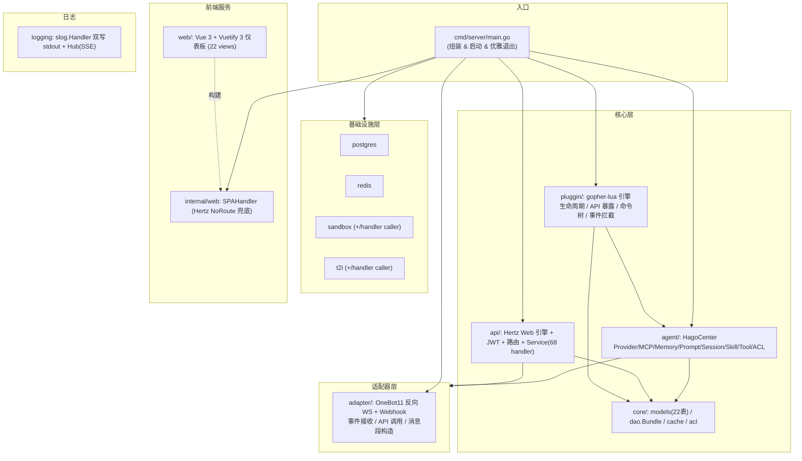

## 模块职责

| 模块 | 包路径 | 职责 |
|------|--------|------|
| **入口** | `cmd/server/main.go` | 组装所有模块、启动服务、反向优雅退出（带 15s watchdog） |
| **适配器** | `internal/adapter/` | OneBot11 反向 WS 服务端 + Webhook HTTP 服务端：事件解析、API 封装、消息段构造 |
| **Agent** | `internal/agent/` | Agent 核心：`HagoCenter` 聚合 Provider/MCP/Memory/Prompt/Session/Skill/Tool/ACL，事件循环、后台任务、Drainer、CronJob、回复策略 |
| **核心库** | `internal/core/` | 数据模型 (GORM)、DAO Bundle、Redis 缓存、ACL |
| **Web API** | `internal/api/` | Hertz Web 引擎、JWT 中间件、路由、Service（68 个管理 handler） |
| **插件** | `internal/pluggin/` | gopher-lua 引擎：生命周期、Lua API 暴露、命令树、事件拦截 |
| **基础设施** | `infrastructure/` | postgres、redis、sandbox、t2i 客户端（每个含 `handler` 子包，功能选项风格） |
| **前端服务** | `internal/web/` | `SPAHandler` 通过 Hertz `NoRoute` 兜底服务 `web/dist` |
| **日志** | `internal/logging/` | slog Handler 双写 stdout + Hub（环形 250 条 + SSE 订阅） |

> **术语陷阱**：`internal/adapter.Provider`=OneBot11 反向 WS 适配器；`internal/agent/provider.ProviderGroup`=LLM Provider 组。`pluggin` 是有意拼写（Lua 插件系统），不要改成 `plugin`。`docs/guidance.md` 拼成 `inferstructure` 是错的，真实路径是 `infrastructure/`。

## 数据模型

共 22 个 GORM 表（见 `internal/core/core.go::AutoMigrate`）。

```mermaid
classDiagram
  class AdminUser { +uint ID; string Username; string PasswordHash; string Role }
  class Provider { string ID; ModelType Type; string Endpoint; string Token; string Model; float32 Temperature; bool IsActive }
  class MCPServer { string ID; string ServerURL; JSONMap Headers; int Timeout; JSONSlice ToolFilter; bool IsActive }
  class Skill { string ID; JSONSlice Keywords; string RegexPattern; string PromptRef; JSONSlice ToolRefs; JSONSlice McpRefs; int Priority }
  class ToolConfig { string ID; string Name; JSONMap Parameters; bool IsBuiltin; bool IsActive }
  class Prompt { string ID; PromptType Type; string Content; bool IsSystem; bool IsActive }
  class Onebot11Adapter { uint ID; string Addr; int Port; string Token; JSONSlice AdminQQNumbers; bool Enabled }
  class WebhookConfig { uint ID; string Addr; int Port; string Token; bool Enabled }
  class T2IConfig { uint ID; string BaseURL; int Timeout; bool IsActive }
  class SandboxConfig { uint ID; string BaseURL; string APIKey; int Timeout; bool IsActive }
  class ChatArea { string ID; AreaType AreaType; int64 TargetID }
  class Session { string ID; string Model; int64 TokenUsage; JSONMap MetaData }
  class ShortTermMemory { string ID; int WindowSize; bool AutoCompact }
  class LongTermMemory { string ID; int HotAreaSize; int HotMemoryTTL }
  class LongTermMemoryItem { string ID; string Content; []byte Embedding; JSONMap Metadata }
  class BackgroundTask { string ID; TaskStatus Status; string MessageType; int64 TargetID; string UserPrompt; JSONMap Steps; JSONMap Results }
  class ChatRecord { int64 ID; int64 UserID; string Role; string Content; int TokenCount; JSONMap ToolCalls }
  class ACLRule { int64 ID; ACLScope Scope; ACLPermission Permission; ACLTargetType TargetType; JSONSlice UserIDs }
  class CronJob { string ID; string CronExpr; string Message; string MessageType; int64 TargetID; bool IsActive; time Time LastRunAt }
  class ReplyStrategyConfig { string ID; ReplyStrategy Strategy; float64 RelevanceThreshold; string BotName; bool StripMarkdown; bool AgentLite }
  class Plugin { string ID; string Name; string Version; string Path; JSONMap Config; bool IsActive }

  ChatArea "1" --|> "1" Session
  ChatArea "1" --|> "1" ShortTermMemory
  ChatArea "1" --|> "1" LongTermMemory
  LongTermMemory "1" --|> "N" LongTermMemoryItem
  ChatArea "1" --|> "N" ChatRecord
  ChatArea "1" --|> "N" BackgroundTask
  ChatArea "1" --|> "N" ACLRule : "按 scope 分组"
```

### 关键模型语义

- **`ChatArea`**：私聊/群聊最小隔离单元，是 Session / Memory / BackgroundTask / ChatRecord / ACLRule 的父级。由首条消息自动 `GetOrCreate` 创建，无手动创建接口。
- **`ChatRecord`**：`id` 为自增 int64（其他模型多为 UUID）。`Session.AppendRecord` 写 Postgres 与短期记忆 Redis 写入**解耦**——前者为审计/检索，后者为 Agent 上下文窗口。
- **单行配置**：`Onebot11Adapter`/`WebhookConfig`/`T2IConfig`/`SandboxConfig` 固定 `id=1`，首次访问 DB 不存在时 `InitConfig` 用 `OnConflict DoNothing` 创建默认行。
- **`ReplyStrategyConfig`**：无 `DeletedAt` 的单例，默认 `strategy=always, relevance_threshold=0.5`。
- **Prompt `IsSystem`**：启动时 `EnsureSystemPrompt` 幂等播种 `__system_locked__`，强制拼接（顺序 SystemLocked → system → personality → custom）。
- **Plugin `Manifest.System`**：系统插件三层守卫（Manifest.System + `PluginEngine.IsSystem()` + Service 层 Toggle/Delete）禁删/禁停。
- **`CronJob`**：不与 ChatArea 建外键；触发时由 `cronjob.Manager` 构造合成 `adapter.Event{PostType:"cronjob", IsCronJob:true}` 经 `CronJobEvents` channel 注入事件循环。

## 状态管理

- **持久化状态** → Postgres（22 张表）
- **缓存状态** → Redis（短期记忆滑动窗口 `shortterm:msgs:<areaID>`、PubSub 任务结果通知、插件/Agent 任意 KV/Hash）
- **插件数据隔离** → Cache 键以 `pluggin:<name>:` 前缀命名空间隔离（注意：`database.query` 当前未真正应用前缀，是 `prefixSQL` 桩）
- **例外** → Lua 插件配置由 `data/pluggins/<name>/pluggin.yaml` 管理（非 DB，便于 bind-mount 跨镜像保留）
- **可插拔服务** → T2I / Sandbox 未配置时自动返回未启用提示；启用时由 API 层 `OnUpdateT2I`/`OnUpdateSandbox` 回调热注入 HagoCenter 与 Service 共享的 `*Client` 指针
- **原则** → 内存中有状态模块（Agent / Memory / Skill）最终与 DB 同步；**不引入纯内存状态**

## HagoCenter 运行时拓扑

`HagoCenter`（`internal/agent/agent.go`）是 Agent 运行时聚合体。`Start` 后并发起 4 个 goroutine：

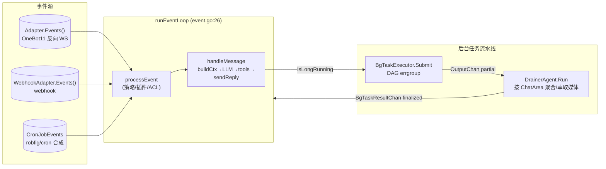

- **`BgTaskExecutor`**（`bgtask_executor.go`）：长任务 DAG 调度器，MCP 优先 + 内置工具回退；启动时 `recoverTasks` 从 DB 恢复未完成项。
- **`DrainerAgent`**（`drainer.go`）：按 ChatArea 聚合后台步骤输出，正则提取 CQ 媒体段，文本占位合并后推 `BgTaskResultChan`。
- **`CronJobManager`**（`cronjob/cronjob.go`）：`robfig/cron` 调度（秒级），命中后构造合成事件。
- **事件循环 5 个 select 分支**：`ctx.Done` / `Adapter.Events`（断流自愈）/ `webhookEvents` / `BgTaskResultChan` / `CronJobEvents`。

## Agent 子包

| 子包 | 实现 | 说明 |
|------|------|------|
| `provider` | `provider.go` | OpenAI 兼容 `/v1/chat/completions`（流式 SSE）、`Vision`（inline base64）；`ProviderGroup` 同类型单 Active 管理 |
| `mcp` | `mcp.go` | `mark3labs/mcp-go` SSE 客户端；`MCPGroup` 聚合连接 + `ListTools`/`CallTool`（MCP 可覆盖 builtin 同名工具） |
| `memory` | `memory.go` + `shortterm`/`longterm`/`bgtask` | 三层记忆：短期(Redis 滑窗, 可 LLM 压缩入长期) / 长期(Postgres + 内存 LRU HotArea) / 后台任务内存 |
| `prompt` | `prompt.go` | `PromptManager` + 系统锁定提示词 `EnsureSystemPrompt` 幂等播种 + `BuildFullContext` |
| `session` | `session.go` | `SessionManager`：`GetOrCreate` / `AppendRecord`(Postgres) / `UpdateTokenUsage` |
| `skill` | `skill.go` | `SkillEngine.Match(input)` 按关键词 / 正则 / priority 匹配首个激活技能 |
| `tool` | `tool.go` / `builtin.go` | `ToolRegistry` + 内置工具 `RegisterBuiltinTools`（OneBot11 / 沙箱 / T2I / vision 等，长任务标记 `IsLongRunning`） |
| `cronjob` | `manager.go` | `robfig/cron` 调度 + 合成事件 |
| `bgtask_executor` / `drainer` | 见上 | 长任务 → Drainer 流水线 |

## 插件 API 分组（速查）

| 权限 | 全局表 / SDK 字段 | 函数 | 说明 |
|------|--------|--------|------|
| 始终 | `log` (`jn.log`) | 3 | info/warn/error → slog |
| 始终 | `json` (`jn.json`) | 2 | encode/decode |
| `onebot11` | `onebot11` (`jn.onebot11`) | 21 | 消息发送 + 群管理 + 信息查询 + 请求处理 + 登录/状态/版本 |
| `http` | `http` (`jn.http`) | 2 | get/post（30s 超时） |
| `database` | `database` (`jn.database`) | 2 | query/exec（共享 DB，前缀桩未生效，⚠ 权限敏感） |
| `cache` | `cache` (`jn.cache`) | 4 | get/set/del/exists（`pluggin:<name>:` 命名空间） |
| `t2i` | `t2i` (`jn.t2i`) | 5 | generate/generate_url + toggle/is_active/get_config |
| `sandbox` | `sandbox` (`jn.sandbox`) | 8 | create/exec_shell/exec_python/list/delete + toggle/is_active/get_config |
| `agent` | `agent` (`jn.agent`) | 16 | 配置查询 + Provider/MCP/Tool 切换 + switch_provider + compact_memory + get_current_chat_area |
| 内置 | `jn.command` | 1 | `register(path, handler, opts)` 多级命令注册 |

详见 [plugin-development.md](plugin-development.md)。

## 前端 SPA 静态服务

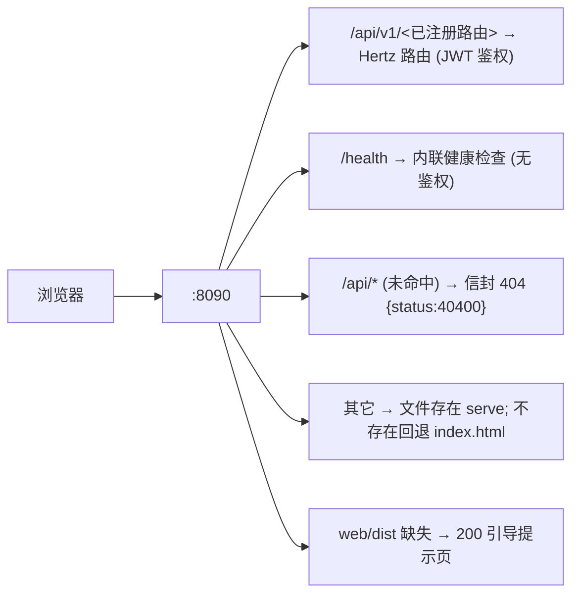

实现：`internal/web/web.go::SPAHandler`（`filepath.Rel` 路径穿越防护）；在 `internal/api/engine/engine.go` 通过 `h.NoRoute(...)` 注册。**不嵌入二进制**（`web/dist` 是磁盘文件，便于只换前端不重编 Go）。开发期 Vite `:3000` 代理 `/api`→`:8090`，Go fallback 不触发。

---

# 二、调用栈

> 调用栈图保留 ASCII 文本风格（开发者熟悉栈格式，mermaid 不便表达调用层）。

## 启动流程

```
cmd/server/main.go:35 main()
├─ logging.NewHandler / slog.SetDefault        main.go:40
├─ postgres.NewPostgresClient(WithHost...)     main.go:46       ← infrastructure/postgres/client.go:58
├─ redis.NewRedisSentinelClient(WithAddr...)   main.go:59       ← infrastructure/redis/client.go:36 (实为单节点)
├─ core.Init(ctx,db,redis)                     main.go:70       ← internal/core/core.go:89
│   ├─ AutoMigrate(db)                         core.go:20       ← 注册 22 张表
│   ├─ cache.NewCache(redisClient, $REDIS_PREFIX) core.go:97     ← "juan:" 前缀
│   ├─ dao.NewBundle(db)                        core.go:105      ← internal/core/dao/dao.go:43 (20 个 DAO)
│   ├─ acl.NewACL(bundle.ACL)                  core.go:110      ← internal/core/acl/acl.go:18
│   └─ InitAdminUser(ctx, UserDAO)             core.go:113      ← core.go:47 (无 admin 时建 admin/Admin123 bcrypt)
├─ middleware.JWTSecret = []byte($JWT_SECRET)  main.go:77
├─ loadAdapterConfig(ctx, DAO)                 main.go:81       ← main.go:355 (DB 加载，回退 env)
├─ adapter.New(cfg) + Start(ctx)               main.go:82-87    ← internal/adapter/adapter.go:28/36
├─ loadWebhookConfig / NewWebhookAdapter / Start main.go:94-110  ← internal/adapter/webhook.go:38/46
├─ agent.NewHagoCenter() / Init / Start         main.go:114-133  ← internal/agent/agent.go:83/96/247
├─ pluggin.NewPluginEngine("data/pluggins",...) main.go:137     ← internal/pluggin/pluggin.go:160
│   └─ pluginEngine.LoadAll()                   main.go:147     ← pluggin.go:207 (ensureEmbeddedAssets + 逐目录 Load)
├─ service.New(...); 注入 ProviderGroup/MCP/... main.go:154-161 ← internal/api/service/root.go:50
├─ loadT2IFromDB / loadSandboxFromDB            main.go:164-165  ← main.go:273/304 (DB 配置 → t2i/sandbox.NewClient)
├─ svc.OnUpdateT2I/OnUpdateSandbox 回调         main.go:166-167  ← 热注入 HagoCenter.T2IClient/SandboxClient
├─ web.EnsureDir($WEB_DIR)                      main.go:175      ← internal/web/web.go:117
├─ engine.New(addr, webDir, svc)               main.go:178      ← internal/api/engine/engine.go:16 (h.NoRoute=SPAHandler)
└─ go webEngine.Run() / wait ctx                main.go:184-199
```

## 优雅退出（`cmd/server/main.go:206 shutdown`）

```
shutdown(adapterProv, webhookAdapter, hago, webEngine, pluginEngine)
├─ hago.Stop()                                    main.go:222   ← agent.go:275 (关 OutputChan/BgTaskResultChan)
├─ webhookAdapter.Stop(ctx 5s)                    main.go:225   ← webhook.go:87 (3s graceful)
├─ adapterProv.Stop(ctx 5s)                      main.go:231   ← adapter.go:87 (close events，置 nil 以便重启)
├─ webEngine.Shutdown(ctx 5s)                     main.go:239   ← 先停 adapter 避免锁竞争
└─ (pluginEngine: 占位)
外层 watchdog：15s 超时强退                       main.go:209-214
```

## OneBot11 反向 WS 事件接收到解析

```
ws_conn ──HTTP upgrade──▶ adapter/server.go:190 handleWS
├─ checkAuth(r)                                 server.go:327   (Bearer token 或 ?access_token=)
├─ websocket.AcceptServer
├─ 读握手 {self_id}, register conns[self_id]     server.go:207-228 (新连入会顶掉旧同 self_id)
└─ readLoop                                      server.go:234
    ├─ echo 字段 → responses[echo] chan          server.go:242  (API 调用响应)
    ├─ heartbeat → drop                          server.go:252
    └─ parseEvent(json)                          server.go:287
        └─ 根据 PostType 反序列化子事件 → s.events <- ev (非阻塞, drop-on-full)
                                                    server.go:278-282
```

触发链路：`Adapter.events` ← `wsServer.events` ← `readLoop`。事件入口 `Adapter.Events()` (`adapter.go:124`)。

## OneBot11 API 调用（Agent 工具 / 插件 → WS）

```
Adapter.SendPrivateMsg(uid, msg)                 api.go:15
└─ call("send_msg", {user_type:"private",...})   api.go:208
   └─ server.callAPI(action, params)             server.go:138
      ├─ conn = selfID() 取首连                   server.go:139
      ├─ echo = atomic.AddUint64(&seq)
      ├─ responses[echo] = make(chan *APIResponse, 1)
      ├─ conn.WriteJSON(APIRequest{Action,Params,Echo})
      └─ select { ch → parse; 10s timeout; <-ctx }
```

`normalizeMessage`（`api.go:324`）兼容 string / `Segment` / `[]Segment` / `*MessageBuilder`，含 CQ 码时重新解析。

## Agent 事件循环（核心路径）

```
runEventLoop                                     agent/event.go:26
└─ select {
   case <-ctx.Done(): stop
   case ev := <-h.Adapter.Events():              event.go:41
       若 channel 关闭(适配器重启): sleep 1s 重新取 Events() (event.go:46)
       h.processEvent(ctx, ev)
   case ev := <-webhookEvents:                   event.go:54 (WebhookAdapter != nil 时)
       h.processEvent(ctx, ev)
   case out := <-h.BgTaskResultChan:             event.go:64
       sendReply 直发媒体 CQ                       event.go:67
       bgTaskOutputToEvent → processEvent (IsBgTaskResult=true, 跳 ACL)
   case ev := <-h.CronJobEvents:                  event.go:88
       processEvent (PostType="cronjob" → 跳策略/ACL)
   }
```

### processEvent（策略 + 插件拦截）

```
processEvent                                       event.go:128
├─ PostType=="webhook" → PluginEngine.OnWebhook, return    event.go:135
├─ PostType=="cronjob" → handleMessage (跳策略/ACL)          event.go:150
├─ IsBgTaskResult → 刷新 StripMarkdown/AgentLite → handleMessage (跳策略/ACL)  event.go:157
├─ 私聊: 刷新策略 cfg; StrategyNeverReply → skip
│        PluginEngine.OnMessage → 命中则 return
│        否则 handleMessage                                  event.go:168-201
├─ 群聊: 刷新策略 cfg; switch Strategy
│   never_reply → skip
│   at_only → 仅 isAtSelf 通过
│   plugin_only → runPluginOnly, return
│   relevance → 提取近消息+图片, relevanceAgentEvaluate (LLM/Vision 判定) >= threshold 通过
│   always → 通过                                          event.go:203-248
├─ PluginEngine.OnMessage → consumed=true 短路              event.go:251-263
└─ handleMessage(ev)                                       event.go:284
```

### handleMessage（LLM 对话主流程）

```
handleMessage                                       event.go:284
├─ chatArea = DAO.ChatArea.GetOrCreate(type, target) event.go:296
├─ ACL: 非admin/BgTaskResult/CronJob → ACL.CheckChat  (false→append tool msg 回写)
│                                                   event.go:308-311
├─ h.Session.GetOrCreate(chatArea.ID)               event.go:312
├─ skillMatched = h.Skills.Match(userMsg)            event.go:315
├─ llm = h.Providers.SelectModel(ModelTypeText)      event.go:317
├─ longTermMems = h.Memory.GetLongTermMemory          event.go:321
├─ toolList / toolDescs = h.buildToolList(ctx)        event.go:326 / agent.go:257
├─ h.CurrentMsg / h.CurrentSessionCtx = buildSessionContext(...)  event.go:337
├─ systemCtx = h.Prompt.BuildFullContext(longTermMem, toolDescs)  event.go:342
├─ messages 组装: systemPrompt → sessionCtx → [Active Skill:] → 短期记忆 → user
│                                                   event.go:349-388
├─ AddShortTermMessage + Session.AppendRecord (Postgres 解耦)    event.go:380
├─ 读 ReplyStrategy: skipSilenceCheck / agentLite    event.go:391-396
├─ agentLite → 清空 req.Tools + 精简 system prompt    event.go:397-403
├─ llm.Chat(ctx, req) → resp                        event.go:405
├─ Session.UpdateTokenUsage                          event.go:407
├─ 非空内容:
│   群聊检查 isSilenceResponse("__NO_REPLY__" 或静默短语) → drop
│   sendReply + recordChat("assistant",...) + Memory.AddShortTermMessage
│                                                   event.go:410-432
└─ handleToolCalls (当 resp.HasToolCalls)            event.go:437
```

### handleToolCalls（工具调用循环，含长任务分支与递归）

```
handleToolCalls(history, resp)                       event.go:437
└─ for each ToolCall:
   ├─ 选源: h.MCP.HasTool(name) 优先, 否则 h.Tools.Get
   ├─ ACL (admin bypass): CheckMCP / CheckTool → 否定回写 tool-role msg
   ├─ IsLongRunning(name)?
   │   是: h.BgTaskExecutor.Submit(ctx, areaID, msgType, targetID, userMsg, [Step])
   │       立即 sendReply("已提交后台执行...") + 注入占位 tool 结果(LLM 勿生造)
   │       event.go:480-498, 533-552
   │   否: MCP.CallTool / Tools.Execute 同步执行 → history append
   ├─ llm.Chat(history, tools) → 二次回复 → sendReply + 持久化
   └─ 若二次回复仍 HasToolCalls → 递归 handleToolCalls
```

## 后台任务流水线

```
BgTaskExecutor.Run (启动时)                         bgtask_executor.go:203
└─ recoverTasks: 从 DB ListPending/running 重跑      bgtask_executor.go:213
     (缺 TargetID/MessageType 的 legacy 任务标记失败)

BgTaskExecutor.Submit(ctx, areaID, msgType, targetID, userPrompt, steps)  bgtask_executor.go:45
├─ DAO.BackgroundTask.Create(status=pending)
└─ go executeAsync(ctx, taskID)               bgtask_executor.go:80
   └─ errgroup DAG 调度:
      循环 launch 所有 Depends 已满足且未完成的 step
      executeTool(step): MCP.HasTool 优先, 否则 Tools.Execute
      每步部分 DrainerOutput 写入 outputChan(OutputChan)
      全部完成 → Update(done/failed) + 终结 DrainerOutput (StepID="")
        bgtask_executor.go:80-200

DrainerAgent.Run                                              drainer.go:50
└─ select inputChan(out):
   handle: pending[chatAreaID] = append(outputs)
   finalize(当 Status done/failed && StepID==""):
     分离 failed/success, 正则萃取 CQ 媒体到 allMedia,
     文本占位替换为 "[媒体内容]"，合并成
     "[后台任务已完成]\n[失败/完成] stepID: ..."
     resultChan(BgTaskResultChan) <- merged(含 MediaPayloads)
     drainer.go:76-144
```

## CronJob 调度

```
CronJobManager.Run                                 cronjob/manager.go:40
├─ reloadAll: ListActive → cron.AddFunc(expr, makeJobFunc(job))
│   makeJobFunc(job):
│     触发时 DAO.CronJob.UpdateLastRun(now)
│     构造 adapter.MessageEvent{MessageType, RawMessage=job.Message, GroupID|UserID}
│     构造 adapter.Event{PostType:"cronjob", IsCronJob:true, Message:msg, Time:now}
│     非阻塞 send to eventChan (= HagoCenter.CronJobEvents)
│     manager.go:91-126
├─ cron.Start()
└─ <-ctx → cron.Stop()

API 侧变更: AddCronJob/UpdateCronJob/DeleteCronJob/ToggleCronJob
   → svc.CronJobManager.Reload() 同步调度器      service.go:1693/1725/1762/1776
```

## Web API 请求 → handler

```
Hertz server (engine.go:18)
└─ middleware.Recovery → middleware.CORS → router.RegisterRoutes
   └─ /api/v1 组: 中间件 JWTAuth? (各路由按需)
      └─ svc.<Handler> (68 个, 内部走 DTO transfer + DAO)
        成功 → dto.GenFinalResponse(OK, data) → 200
        失败 → GenFinalResponse(<错误码>, nil) → 200
未命中路由:
   /api/* → web.SPAHandler: 即 404 信封 {status:40400,info:"资源不存在"}
   其它   → serve 文件 / 回退 index.html / 引导页
```

## 日志双写（slog → stdout + Hub → SSE）

```
slog.Info("...", k, v) → Handler.Handle            logging/handler.go:36
├─ h.stdio.Handle(ctx, r)              写 stdout (slog.TextHandler)
└─ entry := Entry{Time, Level, Message, Attrs} (含 preAttrs + record attrs)
   h.hub.Push(entry)                    logging/hub.go:42
      环形 buffer[250] 写入 + 副本遍历 subscribers 非阻塞发送

GET /api/v1/logs/stream → svc.StreamLogs          service.go:1567
├─ sse.NewWriter(c)
├─ 阶段1: LogHub.Recent() 250 条按序 WriteEvent("log")
├─ 阶段2: subscribe() 实时 WriteEvent("log", entry)
└─ 每 15s WriteKeepAlive 心跳（兼测死连）
```

---

# 三、EventLoop 与事件流

## 事件来源

JuanNiang-Neo 有三类外部事件源，最终都汇入 `HagoCenter.runEventLoop`（`internal/agent/event.go:26`）：

| 来源 | 通道 | PostType | 备注 |
|------|------|----------|------|
| OneBot11 反向 WS | `h.Adapter.Events()` | `message`/`notice`/`request`/`meta_event` | 由 `internal/adapter/server.go::readLoop` 推送 |
| Webhook | `h.WebhookAdapter.Events()` (`webhookEvents`) | `webhook` | 由 `internal/adapter/webhook.go::handleRequest` 推送；外部 HTTP POST 触发 |
| CronJob | `h.CronJobEvents` | `cronjob` | 由 `agent/cronjob/manager.go::makeJobFunc` 合成 |

另有一路**内部循环**输入：

| 来源 | 通道 | 含义 |
|------|------|------|
| 后台任务结果 | `h.BgTaskResultChan` | Drainer 聚合后的 `DrainerOutput`，媒体直发 + 文本合成事件回环 |

## EventLoop（4 个 goroutine）

`HagoCenter.Start` 启动四个并发 goroutine（`agent.go:247-254`）：

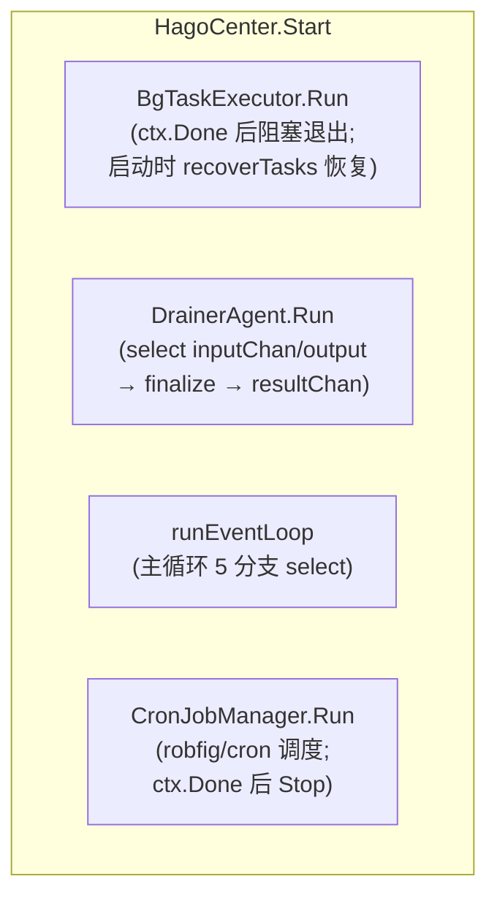

`runEventLoop` 的 5 个 select 分支（`event.go:26-97`）：

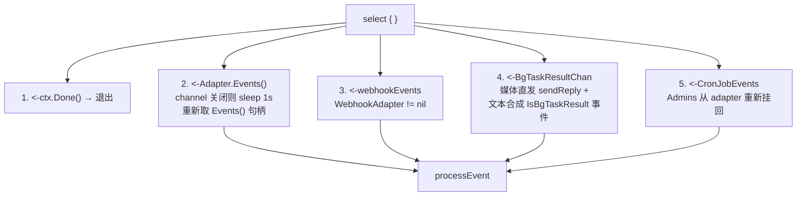

1. `<-ctx.Done()` → 直接退出循环
2. `<-h.Adapter.Events()`：OneBot11 事件。若 channel 关闭（适配器 `Stop` 调用了 `close(events)`），不会 panic——记日志、sleep 1s 重新获取 `Events()` 句柄并 continue（`event.go:46`）。这正是反向 WS 重启后事件循环自愈的关键。
3. `<-webhookEvents`（仅 `WebhookAdapter != nil`）：调用 `processEvent`。
4. `<-h.BgTaskResultChan`：Drainer 后台任务流水线的最终产物。媒体先直接 `sendReply` 发 QQ（不等 LLM），文本摘要合成 `IsBgTaskResult=true` 事件喂回 `processEvent`。
5. `<-h.CronJobEvents`：合成 cronjob 事件，`Admins` 从 adapter 重新挂回后喂 `processEvent`。

## 事件分发决策树（processEvent）

`processEvent`（`event.go:128-266`）按 `PostType` 与回复策略路由：

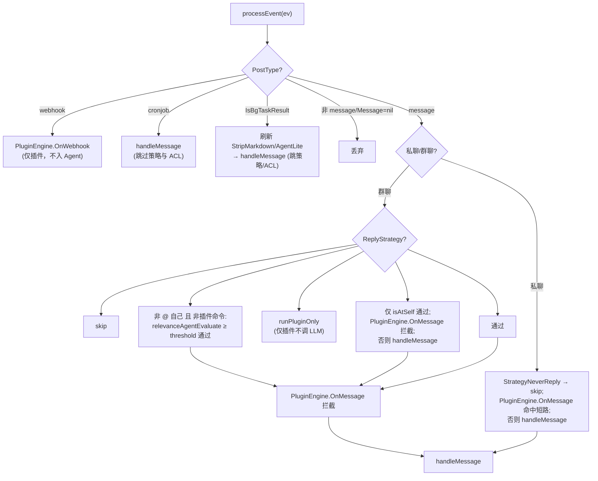

> `isAtSelf`（`reply_strategy.go:234`）做的是精确 `[CQ:at,qq=<self>]` 匹配；优先用当前 `Adapter.SelfID()` 而非缓存 `SelfQQ`，支持机器人换号后立即生效。
> `relevanceAgentEvaluate`（`reply_strategy.go:25`）：消息含图片段且有 Vision Provider → 走 Vision 判定；否则 text 模型 temp 0.3 判定，解析 `{relevance, reason}` JSON。

## 一条消息的全程（OneBot11 → 回执）

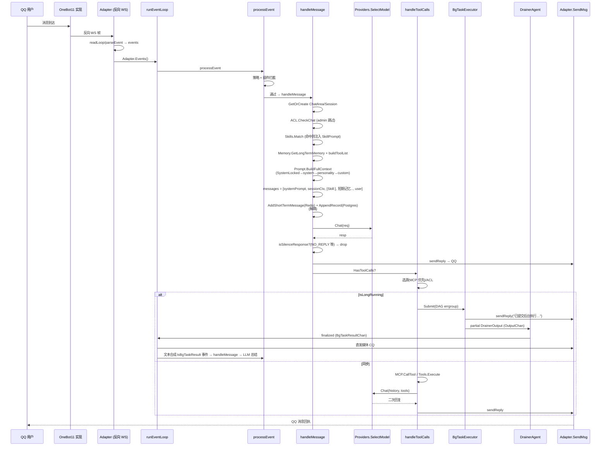

### 工具调用与长任务分流

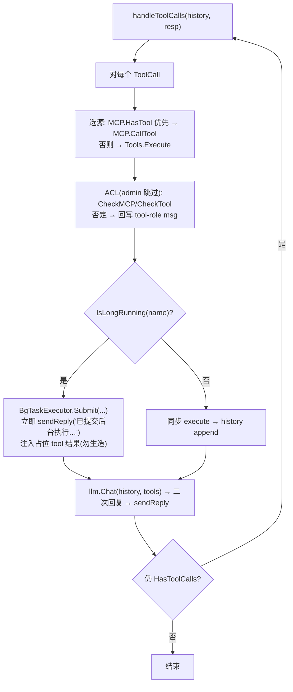

## 长任务回环（BgTaskExecutor → Drainer → EventLoop）

这是 JuanNiang-Neo 区别于简单"调一次工具"的关键设计：长任务后台执行，独立 Drainer 排空缓冲并发送最终 QQ 消息（errgroup 风格并发）。

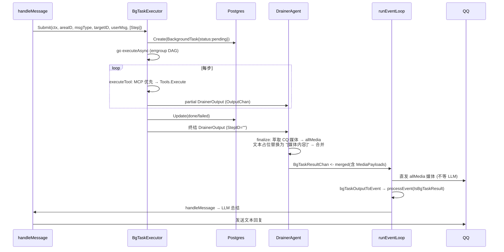

## CronJob 注入流

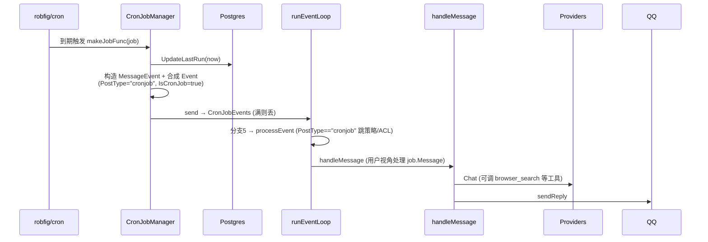

API 侧增删改后 `Manager.Reload()` 同步调度器（`service.go:1693/1725/1762/1776`），无需重启进程。详见 [webhook-cronjob.md](webhook-cronjob.md)。

## Webhook 注入流

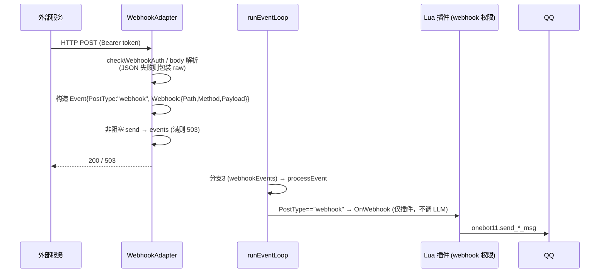

> Webhook 不走 Agent LLM 路径，是对外暴露给 Lua 插件的事件钩子（如 GitHub push 通知触发群发）。详见 [webhook-cronjob.md](webhook-cronjob.md)。

## 关键不变量

- **Adapter 重启不会击穿事件循环**：`Adapter.Stop` 会 `close(events)` 并置 nil，`Start` 时若 `events==nil` 重建（`adapter.go:36-62`）；EventLoop 分支2 检测关闭后 sleep 1s 重新取句柄（`event.go:41-54`）。
- **Redis 与 Postgres 解耦**：短期记忆写 Redis 是为了 LLM 上下文窗口，`Session.AppendRecord` 写 Postgres 是为了审计检索；任一失败不影响另一路。
- **Admins 绕过 ACL**：Admins 列表（来自 `Onebot11Adapter.AdminQQNumbers`）从 adapter 透传到每条 `Event`，`handleMessage`/`CheckMCP`/`CheckTool` 对 admin 一律放行。
- **`__NO_REPLY__` 静默**：LLM 可主动输出 `__NO_REPLY__` 让系统不发任何 QQ 消息（避免群聊噪音）。
- **SystemLocked 强制拼接**：每次对话系统提示词必含 `__system_locked__` 内容，前端不能停用，保证 LLM 知道能用 T2I 富文本、分消息段、权限层级等行为约束。

---

# 四、插件系统

## 概述

JuanNiang-Neo 的 Lua 插件系统基于 `gopher-lua`（Go-Lua 绑定），允许用户通过 Lua 脚本扩展机器人功能。插件可以：

- 拦截 OneBot11 消息事件 / Webhook 事件
- 注册多级斜杠命令（如 `/system provider switch`）
- 调用 OneBot11 协议接口、HTTP、数据库、Redis 缓存、T2I、Sandbox、Agent 操作接口
- 通过内嵌 Lua SDK（`jn.lua`，带 LuaCATS 注解）获得 IDE 类型提示

> **拼写约定**：`pluggin`（双 g 单 n）是**有意**拼写：模块路径 `internal/pluggin`、配置文件 `pluggin.yaml`、插件目录 `data/pluggins`。请勿"修正"为 `plugin`。开发完整指南见 [plugin-development.md](plugin-development.md)。

## 组件结构

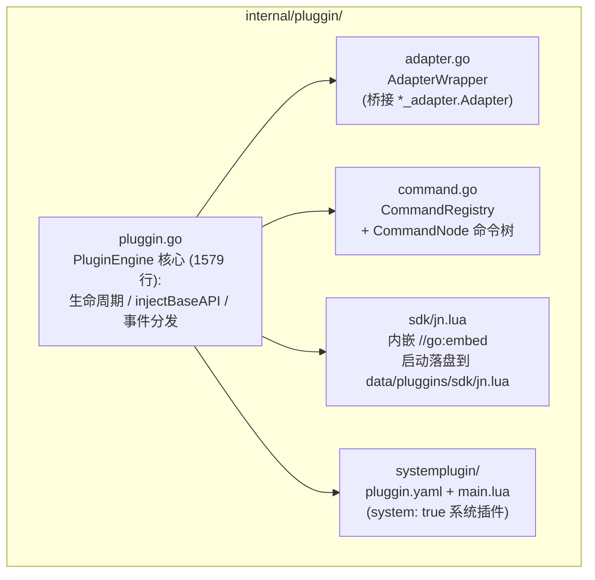

## 生命周期

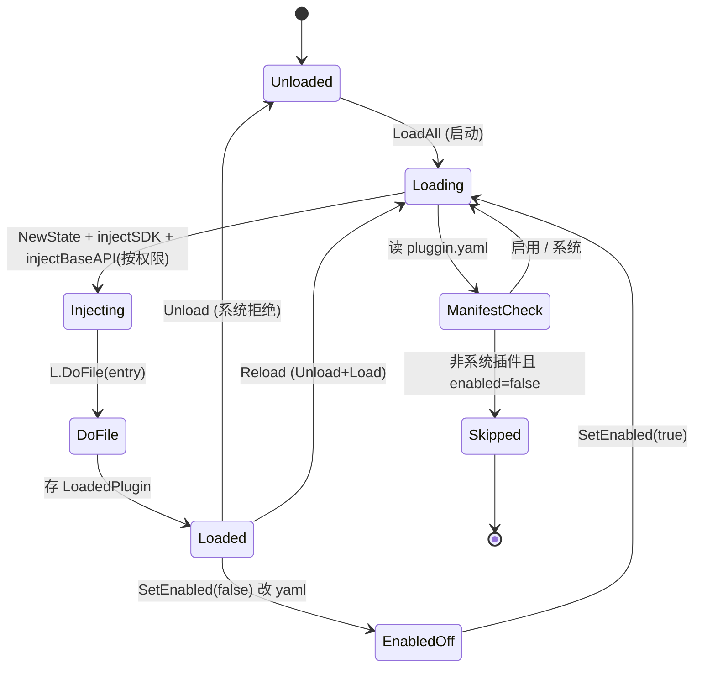

代码位置：

```
LoadAll (启动调用)                              pluggin.go:207
    ├─ ensureEmbeddedAssets: 写 sdk/jn.lua + system/{pluggin.yaml,main.lua}
    │   每次 startup 强制覆盖 (保证镜像升级后插件一致)         pluggin.go:1554
    ├─ 读 basePath (默认 "data/pluggins") 目录
    ├─ 跳过 sdk/ 子目录
    ├─ 逐插件目录: 读取 manifest
    │     非系统插件且 Enabled==false → 跳过 (不加载)
    │     Load(name)                           pluggin.go:239
    └─ (任一插件加载失败仅 slog.Error, 不阻塞其他)

Load(name)                                       pluggin.go:239
    ├─ mutex 持锁; 拒绝重复加载
    ├─ 读 manifest (pluggin.yaml)
    ├─ PPID 为空 → 生成 UUID 并写回 pluggin.yaml          pluggin.go:254
    ├─ lua.NewState
    ├─ injectSDK: <basePath>/sdk/?.lua 追加 package.path (require "jn" 可用)
    ├─ injectBaseAPI: 按 permissions 注入全局表 (log/json/onebot11/http/database/cache/t2i/sandbox/agent)
    ├─ injectCommandAPI: 注入 __jn_internal.register_command
    ├─ L.DoFile(<entry> ; 默认 main.lua) → run
    └─ 存 LoadedPlugin

Unload(name)                                     pluggin.go:281
    ├─ 系统插件拒绝 (返回 err)
    ├─ commands.UnregisterPlugin(name) 清理该插件所有命令
    └─ LState.Close()

Reload(name) = Unload + Load                     pluggin.go:301
SetEnabled(name, bool) 重写 pluggin.yaml 的 enabled 字段    pluggin.go:1439
List() / ListMaps() (后者合并 disk 上未加载的插件, 供 Web API)  pluggin.go:308/321
```

系统插件三层守卫（`Manifest.System` + `PluginEngine.IsSystem()` + Service 层 Toggle/Delete），确保 `system` 插件不可删/停。

## Manifest（`pluggin.yaml`）

| 字段 | 类型 | 说明 |
|------|------|------|
| `ppid` | string | 稳定 UUID（空时自动生成并写回） |
| `name` | string | 插件名（=目录名，作为 `id`） |
| `version` | string | 版本，默认 `"1.0.0"` |
| `author` | string | 作者 |
| `description` | string | 描述 |
| `entry` | string | Lua 入口，默认 `main.lua` |
| `permissions` | string[] | 申请的权限（`onebot11`/`http`/`database`/`cache`/`t2i`/`sandbox`/`agent`） |
| `system` | bool | 系统插件（undeletable / unstoppable） |
| `enabled` | bool | 是否启用（控制是否在 LoadAll 时加载） |

示例（系统插件 `internal/pluggin/systemplugin/pluggin.yaml`）：

```yaml
ppid: 6563c9c3-1072-4168-8bb3-62db4c11990b
name: system
version: "1.0.0"
author: JuanNiang-Neo
description: "系统插件，封装 Agent/Provider/MCP/Tool/T2I/Sandbox/Session 管理命令"
entry: main.lua
system: true
enabled: true
permissions:
  - onebot11
  - agent
  - t2i
  - sandbox
```

## 事件回调

插件通过两个全局 Lua 函数拦截事件（PCall，2 返回值 `(consumed bool, reply string)`）：

| 回调 | 触发 | 权限过滤 |
|------|------|----------|
| `on_message(event)` | 收到 OneBot11 `/` 开头走 commands.Dispatch；否则对每条有 `onebot11` 权限的插件调用 | `onebot11` |
| `on_webhook(event)` | Webhook 事件到达（不走 LLM Agent） | `webhook` |

`EventData` 结构（传给 Lua 的 event table）：

```go
type EventData struct {
    PostType    string
    MessageType string
    UserID      int64
    GroupID     int64
    RawMessage  string
    Admins      []string
    Webhook     map[string]any
}
```

`OnMessage` 决策（`pluggin.go:397-441`）：

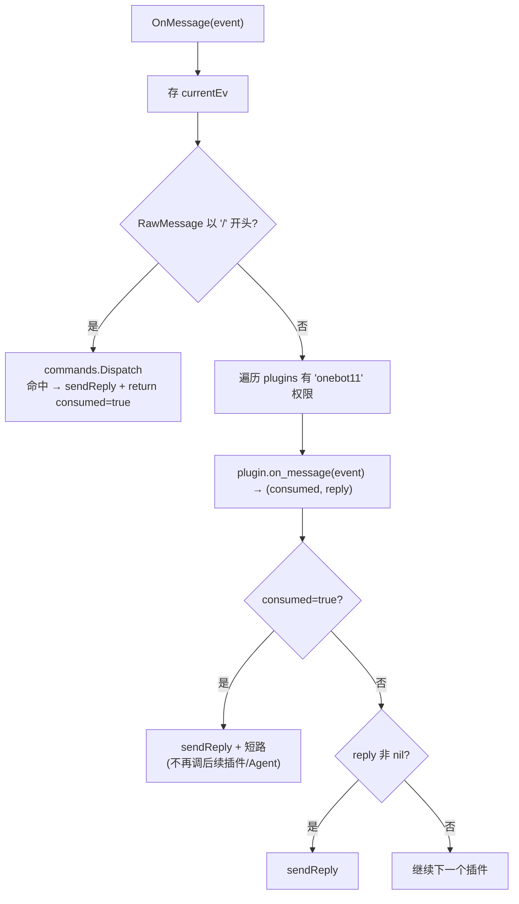

## 命令树（CommandRegistry）

`internal/pluggin/command.go` 实现多级命令派发：

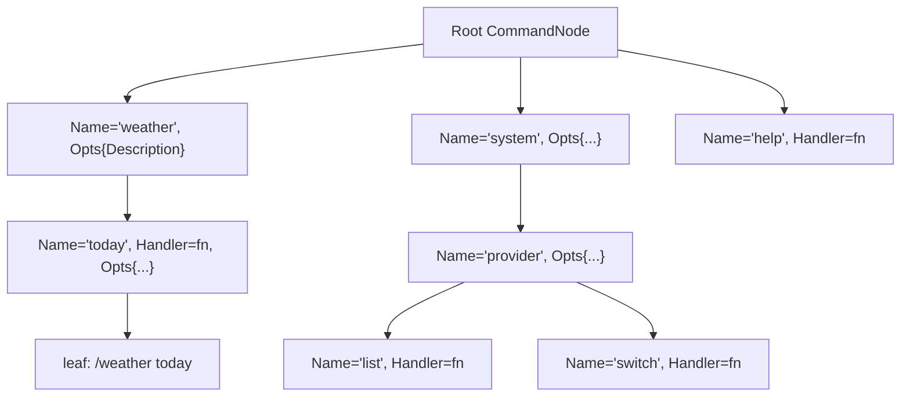

```
CommandNode {Name, Opts{Description,Usage}, Handler, PluginName, Children map}
   长前缀匹配, 最长匹配节点带 Handler 时执行
   未命中 Handler 但停在非 root → 返回该节点子命令列表
   Dispatch(raw, event): 按 "/" 分词遍历, 取最后带 handler 的节点, 调用 handler(剩余 args, event)
```

命令 handler 签名（Go 侧）：

```go
type CommandHandler = func(args []string, event EventData) (consumed bool, reply string, err error)
```

Lua 侧通过 SDK `jn.command.register(path, handlerFn, opts)` 注册，path 可为 string 或 table（多级），handler 接收 `(argsTable, eventTable)` 返回 `(consumedBool, replyString)`。

内置 `/help` 在 `registerBuiltinCommands()` 注册（plugin=`system`），列出所有顶级命令；`/help <cmd> [sub...]` 列出子命令与用法。

插件卸载时 `UnregisterPlugin(name)` 递归清理该插件注册的所有命令并修剪空叶子。

## 注入的 Lua 全局表

按 `permissions` 字段 gated，由 `injectBaseAPI`（`pluggin.go:503-568`）注入。完整签名见 [plugin-development.md](plugin-development.md#api-参考)。

| 全局表 | 权限 | 说明 |
|--------|------|------|
| `log` | 始终 | info/warn/error → slog `[plugin:<name>]` 前缀 |
| `json` | 始终 | encode/decode |
| `onebot11` | `onebot11` | 21 个 OneBot11 API（SendAdapter 接口桥接） |
| `http` | `http` | get/post，30s 超时真实 HTTP |
| `database` | `database` | query/exec（共享 DB；`prefixSQL` 桩未生效，⚠ 任意 SQL） |
| `cache` | `cache` | get/set/del/exists（`pluggin:<name>:` 前缀命名空间） |
| `t2i` | `t2i` | generate / generate_url + toggle/is_active/get_config |
| `sandbox` | `sandbox` | create/exec_shell/exec_python/list/delete + toggle/is_active/get_config |
| `agent` | `agent` | 配置查询 + Provider/MCP/Tool 切换 + switch_provider + compact_memory |
| `jn.command` | 内置 | 命令注册 |

## Lua SDK（`jn.lua`）

由 Go 二进制内嵌（`//go:embed sdk/jn.lua`，`pluggin.go:1543`），启动时 `ensureEmbeddedAssets` 落盘到 `data/pluggins/sdk/jn.lua`（每次覆盖以匹配二进制版本）。`injectSDK` 把 `<basePath>/sdk/?.lua` 追加到 LState 的 `package.path`，使 `require("jn")` 可用。

SDK 仅捕获 Go 注入的全局表作为模块字段（`jn.log = log` 等），不引入额外行为；带 LuaCATS 注解，sumneko lua-language-server 可提供完整代码提示。

```lua
local jn = require("jn")
jn.log.info("插件启动")
local id, err = jn.t2i.generate("<h1>Hello</h1>")
```

## 数据隔离

- **Cache**：所有 `cache.*` 操作自动加 `pluggin:<name>:` 前缀，插件间键不冲突，且无法读写 Agent 的 `session:`/`shortterm:` 前缀。
- **Database**：`database.query/exec` 跑在**共享库**上，`prefixSQL` 桩当前未应用 `pluggin_<name>_` 前缀；请谨慎授 `database` 权限（⚠ 任意 SQL，可在插件侧加自己的表前缀）。
- **插件配置**：`data/pluggins/<name>/pluggin.yaml` 在磁盘，不进 DB（除非 DB `plugins` 表存元数据镜像）。

## 安全建议

- 仅对受信插件授予 `database` 权限
- 对从社区上传的 ZIP 插件先审阅 Lua 源码再 Deploy
- 系统插件 `system` 提供 `/system provider switch`、`/system memory compact` 等管理命令，需要 admin 操作（受 ACL 与 OneBot11 Adapters 的 Admins 双重保护）